# 1 Fix dependencies

## 1.1 Upgrade all dependencies to match the installed SDK version.

```shell
npm install
npx expo install --fix
npm install
```

## 1.2 Try run android

run command: `npm run android` | `expo start`

**Debug run time error**
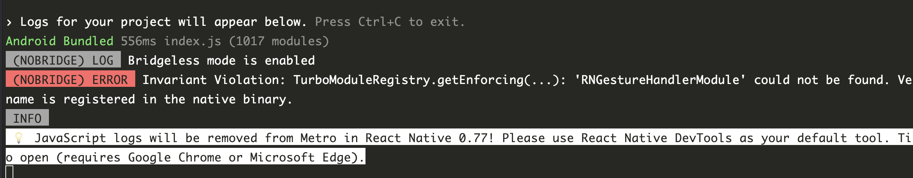

```log
(NOBRIDGE) ERROR  Invariant Violation: TurboModuleRegistry.getEnforcing(...): 'RNGestureHandlerModule' could not be found. Verify that a module by this name is registered in the native binary.
```

**Add react-native-gesture-handler to the dependency**

run command: `npx expo install react-native-gesture-handler`

# 2 Fix Expo-Sqlite

## 2.1 TypeError: Cannot read property 'execAsync' of undefined

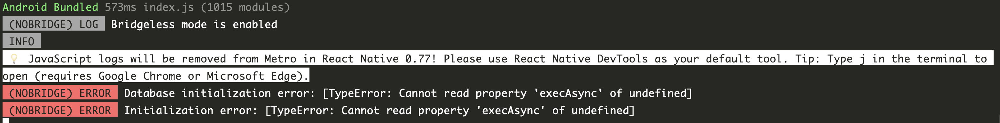
`Database initialization error: [TypeError: Cannot read property 'execAsync' of undefined]`
`Initialization error: [TypeError: Cannot read property 'execAsync' of undefined]`

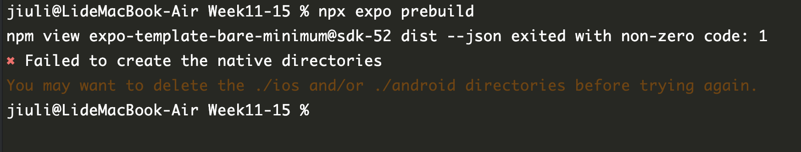
`npx expo install expo-sqlite`

`npx expo prebuild --clean`

**try fix:**`components/database/database.js`

```js
await db.withTransactionAsync(async () => {
    // tx -> db
    await db.execAsync(
        `CREATE TABLE IF NOT EXISTS users (
          id INTEGER PRIMARY KEY AUTOINCREMENT, 
          email TEXT UNIQUE, 
          password TEXT
        );`
    );
    // ......
})
```

## 2.2 TypeError: Cannot read property 'xxx' of undefined

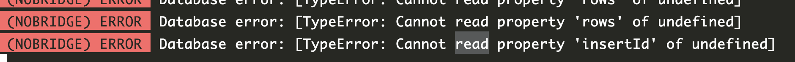
`Database error: [TypeError: Cannot read property 'rows' of undefined]`

`TypeError: Cannot read property 'insertId' of undefined`

**try fix:**`components/database/database.js`

```js
const executeSql = async (query, params = [], isFirst = false) => {
    try {
        if (!isInitialized) {
            await initDatabase();
        }
        if (isFirst) {
            return await db.getFirstAsync(query, params);
        }
        if (query.trim().startsWith('SELECT')) {
            return await db.getAllAsync(query, params);
        }
        return await db.runAsync(query, params);
    } catch (error) {
        console.log('SQL execution error:', error);
        throw error;
    }
};
```

`ERROR Database error: [TypeError: Cannot read property 'length' of undefined]
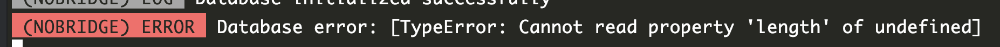

**try fix:**`components/auth/authScreen.js`

```js
 try {
    if (isLogin) {
        // Login logic
        const result = await executeSql(
            'SELECT id FROM users WHERE email = ? AND password = ?',
            [email, password],
            true,
        );
        if (result) {
            navigation.navigate('Home', {userId: result.id});
        } else {
            Alert.alert('Authentication Failed', 'Invalid email or password');
        }
    } else {
        const insertResult = await executeSql(
            'INSERT INTO users (email, password) VALUES (?, ?)',
            [email, password]
        );
        navigation.navigate('Home', {userId: insertResult.lastInsertRowId});
    }
} catch (error) {
    if (error?.toString()?.includes('UNIQUE constraint failed: users.email')) {
        Alert.alert('Registration Failed', 'Email already exists');
        return;
    }
    console.error('Database error:', error);
    Alert.alert('Error', 'An unexpected error occurred. Please try again.');
} finally {
    setIsLoading(false);
}
```

## 2.3 ERROR  Warning: ReferenceError: Property 'Button' doesn't exist

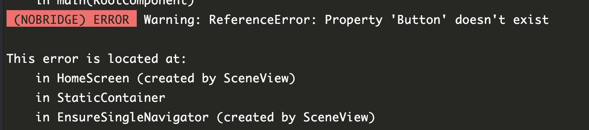

```js
import {Button} from 'react-native';
```

# 3 Fix Expo-Camera

## 3.1 ERROR  Warning: React.jsx: type is invalid

`ERROR  Warning: React.jsx: type is invalid -- expected a string (for built-in components) or a class/function (for composite components) but got: object.`
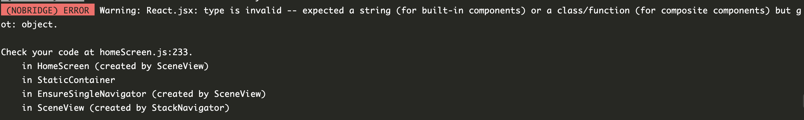

` (NOBRIDGE) WARN  [expo-image-picker] `ImagePicker.MediaTypeOptions` have been deprecated. Use `ImagePicker.MediaType` or an array of `ImagePicker.MediaType` instead.`
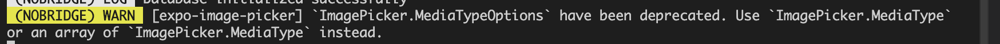

[Expo-Camera](https://docs.expo.dev/versions/latest/sdk/camera/)

**Try add in app.json:**

```json
[
  "expo-camera",
  {
    "cameraPermission": "Allow $(PRODUCT_NAME) to access your camera",
    "microphonePermission": "Allow $(PRODUCT_NAME) to access your microphone",
    "recordAudioAndroid": true
  }
]
```

**Try fix** `screens/homeScreen.js`:

```jsx
import {CameraView, useCameraPermissions} from 'expo-camera';
// ...
const [cameraPermission, cameraRequestPermission] = useCameraPermissions();
// ...
<CameraView
    style={styles.camera}
    ref={(ref) => setCamera(ref)}
    ratio="16:9"
/>
//...
const result = await ImagePicker.launchImageLibraryAsync({
    mediaTypes: ['images', 'videos'],
    allowsEditing: true,
    aspect: [4, 3],
    quality: 0.8,
});
```

# 4 Interaction optimization

## 4.1 The status bar is not clearly displayed.
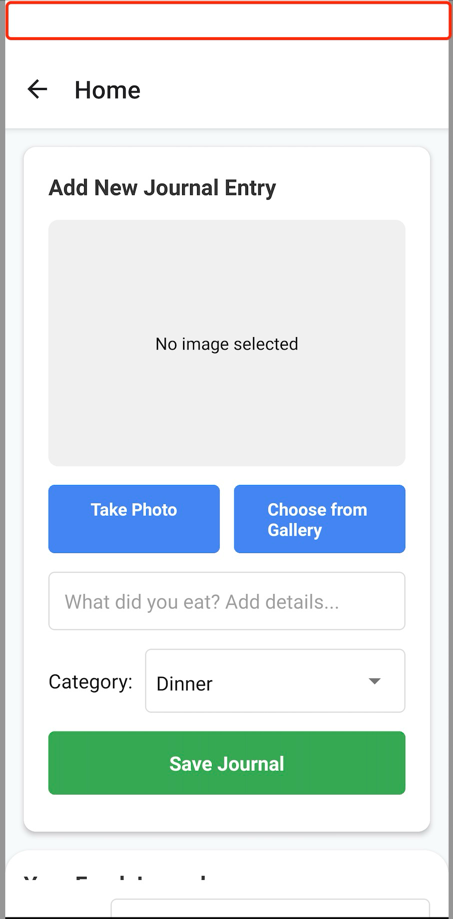

**Try fix** `App.js`:
```jsx
<StatusBar
    backgroundColor="#EEEEEE"
    translucent
    barStyle="dark-content"
/>
```

## 4.2 HomeScreen cannot be displayed completely

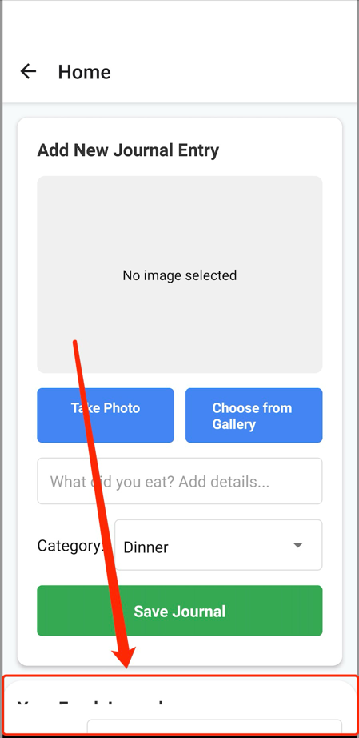

**Try fix** `screens/homeScreen.js`:
```jsx
<SwipeListView
    data={filteredJournals}
    scrollEnabled={false}
    swipeGestureBegan={swipeGestureBegan}
    swipeGestureEnded={swipeGestureEnded}
    directionalLockEnabled={true}
    keyExtractor={(item) => item.id.toString()}
    contentContainerStyle={styles.journalContainer}
    swipeRowStyle={styles.journalRow}
    renderItem={({item}) => (
        <View style={styles.journalItem}>
            <Image source={{uri: item.image}} style={styles.journalImage}/>
            <View style={styles.journalDetails}>
                <Text style={styles.journalDescription}>
                    {item.description}
                </Text>
                <View style={styles.journalMeta}>
                    <Text style={styles.journalCategory}>
                        {item.category}
                    </Text>
                    <Text style={styles.journalDate}>
                        {new Date(item.date).toLocaleDateString()}
                    </Text>
                </View>
            </View>
        </View>
    )}
    renderHiddenItem={({item}) => (
        <View style={styles.hiddenButtons}>
            <TouchableOpacity
                style={[styles.hiddenButton, styles.editButton]}
                onPress={() => {
                    setEditingId(item.id);
                    setDescription(item.description);
                    setImage(item.image);
                    setCategory(item.category);
                }}
            >
                <Text style={styles.hiddenButtonText}>Edit</Text>
            </TouchableOpacity>
            <TouchableOpacity
                style={[styles.hiddenButton, styles.deleteButton]}
                onPress={() => deleteJournal(item.id)}>
                <Text style={styles.hiddenButtonText}>Delete</Text>
            </TouchableOpacity>
        </View>
    )}
    rightOpenValue={-150}
    disableRightSwipe
    showsVerticalScrollIndicator={false}
    windowSize={5}
/>
//...
<KeyboardAvoidingView
    behavior={Platform.OS === 'ios' ? 'padding' : 'height'}
    style={styles.container}>
    {cameraModal()}
    <ScrollView horizontal={false}
                ref={scrollViewRef}
                style={styles.fg1}
                showsVerticalScrollIndicator={false}
                removeClippedSubviews={true}>
        {journalInputSection()}
        {journalListSection()}
    </ScrollView>
</KeyboardAvoidingView>
```

## 4.2 Picker anomaly coupling

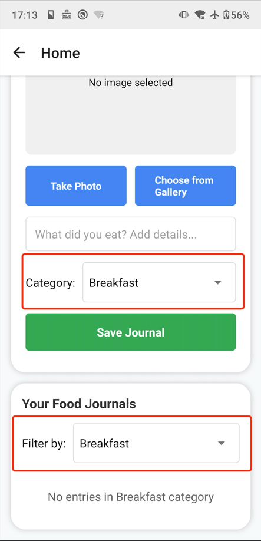

**Try fix** `screens/homeScreen.js`:
```jsx
const [category, setCategory] = useState('All');
const [filter, setFilter] = useState('All');
//...
{/* Category Filter */}
<View style={[styles.filterContainer, styles.ph5]}>
    <Text style={styles.filterLabel}>Filter by:</Text>
    <View style={styles.filterPickerWrapper}>
        <Picker
            selectedValue={filter}
            onValueChange={(itemValue) => setFilter(itemValue)}
            itemStyle={styles.pickerItem}
            style={styles.picker}>
            {categories.map((cat) => (
                <Picker.Item key={cat} label={cat} value={cat}/>
            ))}
        </Picker>
    </View>
</View>


```

## 4.3 Other ui optimizations

**The details are rather messy, so I won't go into too much detail. For the specific information, please refer to the code.**

# Final presentation